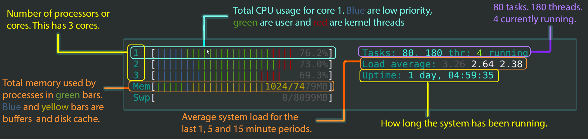
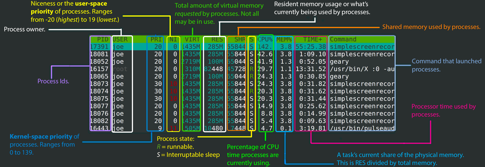

.. _useful_tools:
*********************************
Tools you might want to check out
*********************************

.. contents:: Table of Contents
    :local:

.. _tools_intro:
============
Introduction
============

There are tools out there that can make your workflow **much, much smoother**.
This is a small list of some of the tools that I've found useful throughout my 
stay at Vanderbilt. They have significantly improved my workflow, and 
have made the projects much easier to understand.

.. _htop_sec:
=====================================
htop - An interactive viewer for Unix
=====================================

For viewing which processes are running on your computer and how much 
memory is left, I like to use `htop <https://hisham.hm/htop/>`_.

This application, as shown in 

.. _label: htop_fig
.. figure:: ./images/useful_tools/htop.png
    :alt: htop running in the terminal

    htop running in the terminal.
    Credit: `Wikipedia <https://en.wikipedia.org/wiki/Htop#/media/File:Htop.png>`_

This tools is extremely useful when running multiple jobs, since it lets 
you see which *jobs* are running, for how long they've been running, and 
more. Figure :ref:`htop_fig` how *htop* looks whenever you run this 
from the terminal:

.. code-block:: shell

    htop

.. _htop_explained:
--------------
htop Explained
--------------

htop has different things to offer. Figures :ref:`htop_top_fig` and 
:ref:`htop_bottom_fig` explain what each column means.

.. _htop_top_fig:

   Top of *htop*. This figure shows the different components in the 
   upper part of *htop*.
   Credit: `CodeAhoy <https://codeahoy.com>`_

And the bottom part ...

.. _htop_bottom_fig:

   Top of *htop*. This figure shows the different components in the 
   bottom part of *htop*.
   Credit: `CodeAhoy <https://codeahoy.com>`_

.. _htop_resources:
---------------
Further Reading
---------------

For a **more in depth discussion** of the different sections of :code:`htop`, 
see:

* `htop Explained Visually <https://codeahoy.com/2017/01/20/hhtop-explained-visually/>`_
* `Understanding and using htop monitor system resources <http://www.deonsworld.co.za/2012/12/20/understanding-and-using-htop-monitor-system-resources/>`_
* `htop Explained <https://peteris.rocks/blog/htop/>`_

.. _tmux_screen_sec:
=============================================
tmux and screen - Terminal Multiplexers
=============================================

Another great tool is 

